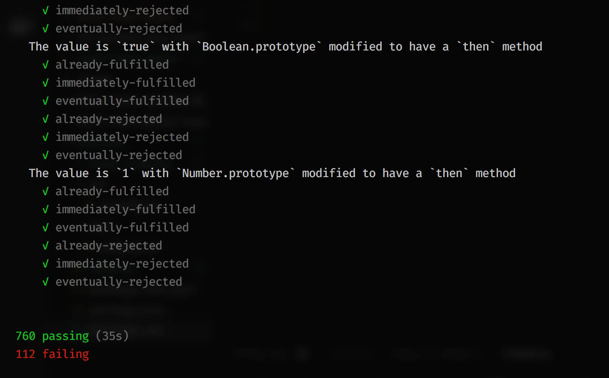

# promiselite

A minimal Promises/A+ complaint `Promise` implementation with 200 lines of code. This implementation is not production ready but for learning the in-depth mechanism of a Promise and its contract to users.

# Promises/A+ tests

`npm run test`

Currently this library passed all the test cases of Promises/A+ (https://github.com/promises-aplus/promises-tests). 

This is test result:

